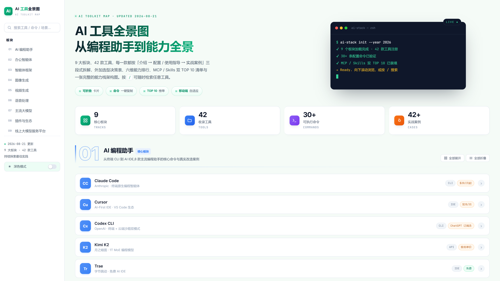
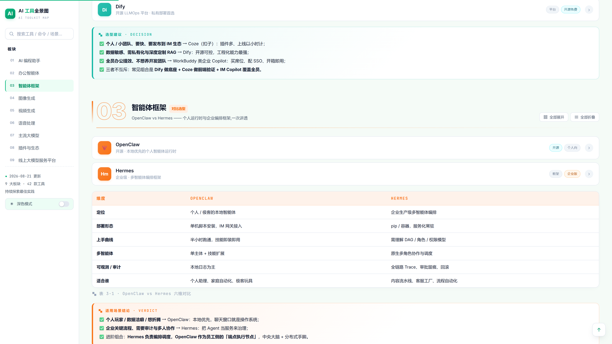
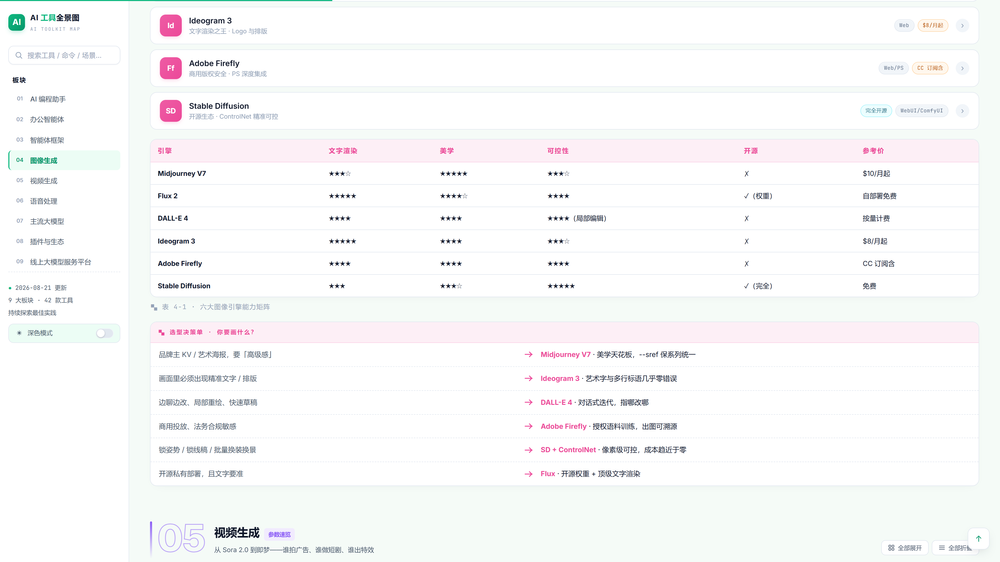
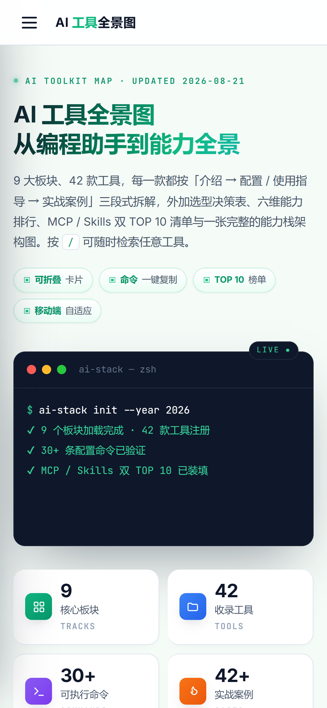
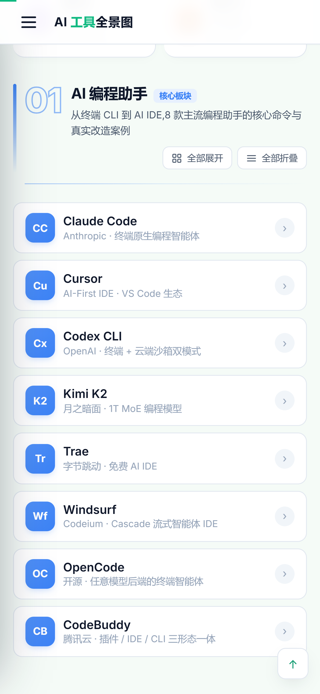
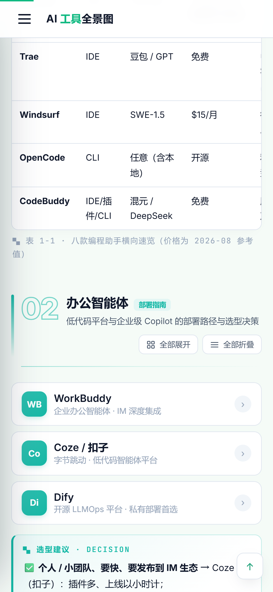

# AI 工具全景图 · AI TOOLKIT MAP

> **9 大板块 · 42 款 AI 工具** —— 一张从编程助手到能力栈架构的交互式全景地图。
> 每款工具按「**介绍 → 配置 / 使用指导 → 实战案例**」三段式拆解，并附带选型决策表、六维能力排行、MCP / Skills 双 TOP 10 清单与完整的能力栈架构图。

纯前端单页应用，**无需构建、无需后端**，双击 `index.html` 即可打开。



---

## 界面预览

### 桌面端

| 首屏（Hero + 统计） | 板块 · 智能体框架 | 板块 · 图像生成（含决策表） |
| --- | --- | --- |
|  |  |  |

### 移动端

| 首屏（带顶栏 + 终端面板） | 板块 · 编程助手 | 表格 · 编程助手横评 |
| --- | --- | --- |
|  |  |  |

---

## 功能特性

- 🗂 **9 大板块导航**：编程助手、办公智能体、智能体框架、图像生成、视频生成、语音处理、主流大模型、插件与生态、线上大模型服务平台。
- 📖 **三段式卡片**：每款工具均含「**介绍 / 配置指导 / 实战案例**」，可点击展开 / 折叠。
- 🖥 **命令一键复制**：代码块与 MCP / Skills 命令点击即可复制，带成功反馈。
- 🔍 **实时搜索**：按 `/` 聚焦搜索框，实时过滤工具卡片（支持工具名、命令、场景等关键词），并自动展开匹配项。
- 📊 **数据可视化**：板块级「全部展开 / 全部折叠」、数字滚动统计（9 / 42 / 30+ / 42+）、六维能力排行榜、MCP / Skills 双 TOP 10。
- 🏗 **能力栈架构图**：L0 基础设施 → L1 模型层 → L2 协议与技能 → L3 智能体层 → L4 应用层，一览 AI 技术栈全景。
- 🌗 **深色模式**：侧边栏一键切换，跟随系统主题，记忆用户偏好。
- 📱 **移动端自适应**：响应式布局，移动端顶栏汉堡菜单 + 抽屉式侧边栏 + 右下角「返回顶部」按钮。
- ♿ **无障碍与减弱动效**：滚动渐入、阅读进度条、`prefers-reduced-motion` 减弱动画支持。

---

## 快速开始

无需安装任何依赖。直接用浏览器打开即可：

```bash
# 方式一：直接双击打开
index.html

# 方式二：本地静态服务器（推荐，避免浏览器安全限制 / file:// 跨域）
python -m http.server 8080
# 然后访问 http://localhost:8080
```

### 技术栈

- 纯原生 **HTML / CSS / JavaScript**，无任何外部依赖（仅 Google Fonts）。
- **数据驱动渲染**：所有工具数据集中在 `aihot_data.json` 中，由 `index.html` 启动时按需加载，便于维护与二次开发。

---

## 9 大板块速览

| # | 板块 | 主题标签 | 亮点 |
| - | --- | --- | --- |
| 01 💻 | 编程助手 | 核心板块 | Claude Code / Cursor / Codex / Kimi K2 / Trae / Windsurf / OpenCode / CodeBuddy · 八款编程助手横向速览表 |
| 02 🏢 | 办公智能体 | 部署指南 | WorkBuddy / Coze / Dify · 选型建议决策表 |
| 03 🤖 | 智能体框架 | 对比选型 | OpenClaw vs Hermes · 六维对比表 + 适用场景结论 |
| 04 🎨 | 图像生成 | 决策参考 | Midjourney / Flux / DALL-E / Ideogram / Firefly / SD · 按需求选模型决策单 |
| 05 🎬 | 视频生成 | 参数速览 | Sora / 可灵 / Veo / Runway / 即梦 / Vidu·Pika·Luma · 参数速览表 |
| 06 🔊 | 语音处理 | 横评推荐 | ElevenLabs / Cartesia / Hume / 火山 / CosyVoice / F5 / GPT-SoVITS / ChatTTS · 八款横评 + 组合推荐 |
| 07 🧠 | 主流大模型 | 六维排行 | GPT-5 / Claude 4 / Gemini / Qwen 3 / DeepSeek V4 / Kimi K2 / Llama 4 · 六维能力排行榜 |
| 08 🔌 | 插件与生态 | 生态必装 | MCP 协议 / Skills 技能 / 六大市场对比 · MCP & Skills 双 TOP 10 |
| 09 🌐 | 线上大模型服务平台 | 平台速查 | 主流大模型 API 服务平台横向速查 |

---

## 顶部统计

首屏实时滚动的四组数字（来自数据自动统计）：

| 核心板块 | 收录工具 | 可执行命令 | 实战案例 |
| --- | --- | --- | --- |
| **9** | **42** | **30+** | **42+** |
| TRACKS | TOOLS | COMMANDS | CASES |

> 旁边的小型终端会以打字机效果输出 `ai-stack init --year 2026` 的初始化日志。

---

## 使用说明

### 快捷键

| 按键 | 功能 |
| --- | --- |
| `/` | 聚焦搜索框（移动端会同步打开侧边栏） |
| `Esc` | 清空搜索并退出输入 |

### 搜索

在侧边栏搜索框输入关键词，即可实时过滤匹配的工具卡片，并显示「▸ N 个匹配结果」。支持搜索工具名称、命令、场景等任意文本；命中时卡片会自动展开。

### 全部展开 / 折叠

每个板块头部右上角提供「**全部展开**」「**全部折叠**」两个按钮，可一键展开或收起该板块内所有工具卡片，便于快速浏览或深度阅读。

### 复制命令

代码块右上角的「复制」按钮、MCP / Skills TOP 10 列表中的命令均可点击复制，按钮会短暂显示「✓」作为反馈。

### 深色模式

侧边栏底部「深色模式」开关可一键切换主题；选择会被记入 `localStorage`，下次访问自动应用。

---

## 同步到 GitHub + Gitee

项目配置为同时推送 **GitHub** 与 **Gitee** 两个远程仓库（`git remote` 为 `origin` 配置了两个 push 地址，单次 `git push origin` 即可推送全部）。

手动提交并同步：

```bash
git add .
git commit -m "提交说明"
git push origin        # 同时推送到 GitHub + Gitee
```

---

## 项目结构

```
ai-toolkit-map/
├── index.html         # 单页应用主体（样式 + 结构 + 脚本）
├── aihot_data.json    # 工具数据的独立 JSON 源文件
├── imgs/              # README 文档插图（PC / Mobile 截图）
│   ├── pc-01-hero.png
│   ├── pc-03-office.png
│   ├── pc-04-table.png
│   ├── mob-01-hero.png
│   ├── mob-02-coding.png
│   └── mob-03-table.png
├── README.md          # 项目说明（即本文件）
├── LICENSE            # MIT 协议
└── .gitignore         # 忽略系统 / 编辑器 / 临时文件
```

---

## 数据维护

所有展示数据集中于 `aihot_data.json`（被 `index.html` 启动时 `fetch` 加载）。新增 / 修改工具时：

1. 在对应板块（`sections[i]`）的 `tools` 数组中追加对象，字段包括：`name`、`sub`、`chips`、`intro`、`config`（代码块 / 列表 / 流程图 / 标签）、`case`。
2. 可选补充 `table`（对比表）、`decide`（选型决策）、`verdict`（结论）、`rank`（排行）、`top10`（榜单）、`arch`（架构图）。
3. 首页统计（板块数 / 工具数 / 命令数 / 案例数）由 `index.html` 在加载时根据数据自动计算，无需手动维护。

---

## 说明

- 各工具价格为 **2026-08 参考值**，实际以官方为准。
- 本页内容基于公开资料整理，**仅供学习与选型参考**。
- 项目为纯前端演示页，无任何后端与数据采集逻辑。
- 页面中涉及的各工具名称、商标与产品归属其各自所有者，本项目的引用仅作学习与选型参考。

---

## 开源协议

本项目基于 **MIT License** 开源，详见 [LICENSE](LICENSE)。

你可以自由使用、修改、分发本项目代码，仅需保留版权声明与本许可协议。

---

*AI 工具全景图 · AI TOOLKIT MAP 2026 — Built with ♥ and a lot of tokens.*
